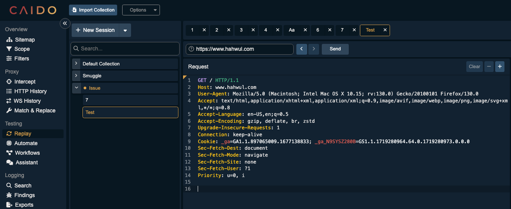

# Midnight in Seoul

A Caido theme inspired by the calm, deep blue tones of a midnight in Seoul.

## How to Apply (Recommended - Latest Method)

Since this theme is now included in the official community themes collection:

1. In Caido, go to the **Plugins** section.
2. Switch to the **Community Store** tab.
3. Search for and install **Caido Themes** (if not already installed).
4. Go to the **Themes** tab in the plugin.
5. Look for **Midnight in Seoul** in the available themes list and apply it directly.

Done!

### Fallback (Manual Import)
If the theme doesn't appear in the list for any reason:
- In the **Themes** tab, go to **Actions** > **Import**.
- Load the [midnight-in-seoul.json](midnight-in-seoul.json) file (you can download it from this repo or the [caido-community/CaidoThemes](https://github.com/caido-community/CaidoThemes) packages folder).
- Apply the imported theme.

Enjoy the quiet, blue-night vibe of Seoul right in your Caido interface.
